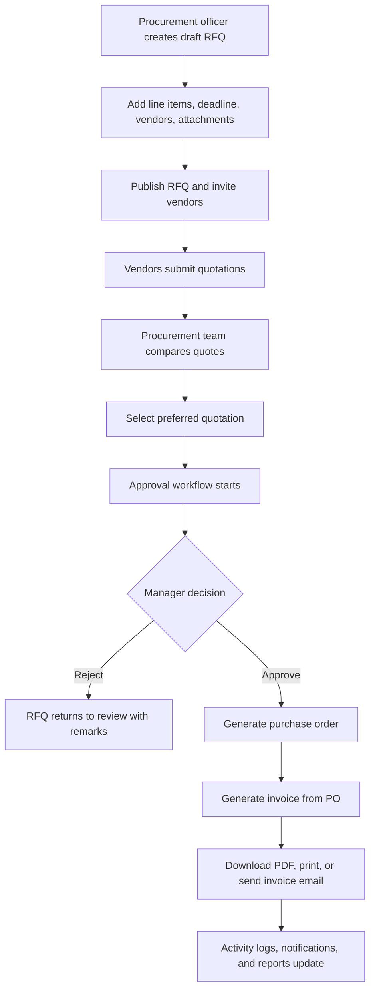

# VendorBridge Master Shipping Plan

Date: 2026-06-06

Purpose: turn the current VendorBridge scaffold into a complete procurement and vendor management ERP that matches the brief end to end, with a premium web-first UI, secure role-based workflows, strict validation, auditability, and a demo-ready plus production-minded architecture.

This document is intentionally detailed. It is the plan to ship the product, not just make the screens look busy.

## 1. Current Repo Audit

### Current stack

- Frontend: React 19, Vite 8, React Router 7, Axios, plain CSS files.
- Backend: Node.js, Express 5, Prisma 6, PostgreSQL.
- Auth dependencies declared: `bcryptjs`, `jsonwebtoken`.
- Database ORM: Prisma schema and one initial migration.
- Existing docs: `Plans/VendorBridge-plan.md` and `Plans/VendorBridge-design.md`, both useful as early notes but incomplete versus the brief.

### Current implemented modules

- Auth:
  - Backend has `/api/register`, `/api/login`, `/api/me`.
  - Frontend has `AuthContext`, login, register, and `ProtectedRoute`.
  - JWT is stored in `localStorage`.
  - Forgot password is only a dead link.
  - Role-based route restrictions are not applied across feature routes.
  - Vendor role does not exist in the Prisma enum yet.

- Dashboard:
  - Shows total vendors, RFQs, quotations, and a hardcoded pending approvals count.
  - Polls vendors/RFQs/quotations.
  - Recent RFQs table exists.
  - No POs, invoices, real approvals, notifications, spending analytics, or trend charts.

- Vendor Management:
  - Vendor create/list/search exists.
  - Supports name, email, phone, address, category.
  - Missing GSTIN, contact person, tax address, payment terms, vendor rating, status edits, category management, attachments, activity history, duplicate detection, and role-linked vendor portal access.

- RFQs:
  - RFQ list and create screen exist.
  - Supports title, description, budget, deadline, createdById, vendor assignment.
  - Missing line items, quantity/unit, attachments, category, terms, publish/send invite action, draft autosave, deadline validation, invited vendor portal view, add/remove vendors after draft, RFQ timeline, and close/award transitions.

- Quotations:
  - Quotation list exists.
  - Backend can create quotation and update status.
  - Missing vendor-facing submission screen, editable quotations, line-level prices, tax/delivery/payment terms, attachment support, comparison screen, quote scoring, audit timeline, and selection workflow.

- Approvals:
  - Prisma has an `Approval` model.
  - No approval routes, services, screens, notifications, state transition logic, or role permissions are implemented.

- Purchase Orders and Invoices:
  - Not implemented.
  - No schema models, API, screens, number generation, PDF generation, print view, email sending, status tracking, or tax calculations.

- Activity Logs and Notifications:
  - Not implemented.
  - No audit log model or notification model.

- Reports and Analytics:
  - Not implemented.
  - No report APIs, charts, exports, trend data, or vendor performance scoring.

### Current quality checks

- `frontend npm run build`: passes.
- `frontend npm run lint`: fails.
  - `frontend/src/context/AuthContext.jsx`: Fast Refresh rule fails because component and hook exports share a file.
  - `frontend/src/hooks/usePolling.js`: React hook lint flags synchronous state update pattern in effect.
  - `frontend/src/features/rfq/RFQCreate.jsx`: missing hook dependency warning.
- `backend npm ls --depth=0`: currently reports missing installed packages for `bcryptjs` and `jsonwebtoken`, even though they are declared in `backend/package.json`.
- Database connectivity issue intentionally ignored per user request, but schema/migration consistency still needs to be handled during implementation.

### Biggest gap summary

The current app is a protected CRUD prototype. It is not yet an ERP workflow. The final product needs real procurement state, transaction-safe backend operations, role-specific surfaces, document generation, validation, and a UI that looks like a premium command center rather than a generic dark admin template.

## 2. External Research And Design Guidance

### Product benchmarks reviewed

- [Oracle Fusion Cloud Procurement](https://www.oracle.com/erp/procurement/) positions procurement around buyer work areas, suppliers, sourcing, purchasing, contracts, and invoices.
- [SAP Ariba Procurement](https://www.sap.com/products/spend-management/procurement.html) emphasizes a procure-to-pay command center, invoice visibility, and supplier collaboration.
- [Zoho Inventory RFQ docs](https://www.zoho.com/us/inventory/help/items/request-for-quote.html) show the practical RFQ lifecycle pattern: create RFQ, send to vendors, receive quotes, convert selected vendor quote into purchase order.
- [Coupa Procurement](https://www.coupa.com/products/procurement/) emphasizes guided buying, supplier management, purchasing, approvals, and spend control.
- [Procurify](https://www.procurify.com/) and similar tools emphasize budget visibility, approval speed, purchase orders, and audit-ready workflows.

### Design skill guidance applied

The requested design skills are not installed local Codex skills, but their public guidance was reviewed or used as design direction where accessible:

- [emil-design-eng SKILL.md](https://github.com/emilkowalski/skill/blob/main/skills/emil-design-eng/SKILL.md): interaction quality, motion taste, tiny details, high polish.
- [taste-skill](https://github.com/Leonxlnx/taste-skill): avoid AI-looking UI tropes, avoid emoji-driven interfaces, use real design hierarchy, prefer crisp product UI, fix spacing and alignment.
- [impeccable](https://github.com/pbakaus/impeccable): build like a product designer and product engineer, challenge weak patterns, make visual probes before final UI implementation, inspect every state.

Repo-level implementation will still follow local constraints:

- Use the existing React/Vite stack unless there is a strong reason to migrate.
- Use app-level developer guidance over external style suggestions if they conflict.
- Use lucide-style production icons rather than emoji icons.
- Verify final UI in the browser at desktop and mobile sizes.

## 3. Product Positioning

### Product DNA

VendorBridge is a procurement operations command center for organizations that need to coordinate vendors, RFQs, quotations, approvals, purchase orders, invoices, and audit trails without spreadsheet chaos.

### Primary emotion

Trust, momentum, and control. The app should feel like a calm mission-control surface for real money movement.

### Target users

- Procurement officers who create RFQs, compare vendor responses, and generate procurement documents.
- Vendors who need a simple portal to submit quotations and track RFQ/PO status.
- Managers/approvers who need fast decisions with enough context to approve or reject confidently.
- Admins who manage users, vendors, categories, and procurement analytics.

### Primary action

Move a procurement request forward with confidence: create RFQ, collect quotes, choose best vendor, approve, issue PO, generate/send invoice, and keep the audit trail clean.

## 4. Product Principles

- Workflow first: every screen should make the next procurement action obvious.
- Trust through traceability: every major action creates an activity log entry.
- No fake admin chrome: tables, filters, forms, timelines, and documents must be functional.
- Reduce procurement uncertainty: show who owns the next step, what is blocking it, and what changed recently.
- Strong validation everywhere: client validation for speed, server validation for truth, database constraints for integrity.
- Role-specific UX: users should not see actions they cannot perform.
- Premium but usable: visual polish supports clarity, not decoration.
- Mobile web support: managers and vendors must approve/submit from a phone.

## 5. Final Product Scope

### Public and auth surfaces

- Public landing page for VendorBridge:
  - Hero with live procurement command center visual.
  - Value narrative.
  - Feature storytelling.
  - Animated workflow showcase.
  - Credibility/social proof area.
  - Conversion section.
  - Closing CTA.
  - Premium footer.
- Login.
- Signup.
- Forgot password request.
- Reset password.
- Session restore/loading state.

### Authenticated ERP surfaces

- Dashboard/home.
- Vendor management.
- RFQ creation/edit/detail.
- Vendor quotation submission.
- Quotation comparison.
- Approval workflow.
- Purchase order generation/detail.
- Invoice generation/detail/print/email.
- Activity logs and notifications.
- Reports and analytics.
- Admin user management.
- Settings for company profile, tax defaults, email sender, numbering prefixes, approval rules.

## 6. Target Workflow



## 7. Roles And Permissions

### Role enum

Replace current `BUYER` with explicit procurement language while preserving migration compatibility:

- `ADMIN`
- `PROCUREMENT_OFFICER`
- `VENDOR`
- `APPROVER`

Optional transitional mapping:

- Existing `BUYER` records migrate to `PROCUREMENT_OFFICER`.

### Permission matrix

| Capability | Admin | Procurement Officer | Vendor | Approver |
|---|---:|---:|---:|---:|
| Manage users | Yes | No | No | No |
| Manage vendors | Yes | Yes | No | Read limited |
| Create RFQs | Yes | Yes | No | No |
| Edit draft RFQs | Yes | Yes, own/org | No | No |
| Publish RFQs | Yes | Yes | No | No |
| View assigned RFQs | No vendor portal | No | Yes | No |
| Submit quotations | No | No | Yes | No |
| Edit quotations before deadline | No | No | Yes, own | No |
| Compare quotations | Yes | Yes | No | Read only if needed |
| Select quotation | Yes | Yes | No | No |
| Approve/reject | Yes | No | No | Yes |
| Generate PO | Yes | Yes after approval | No | No |
| Generate invoice | Yes | Yes after PO | No | Read limited |
| Send invoice email | Yes | Yes | No | No |
| View activity logs | Yes | Yes | Own vendor activity only | Approval scope |
| View reports | Yes | Yes | No | Yes, read only |

### Backend enforcement

- Add `authMiddleware` to all resource routes.
- Add `requireRole(...)` or permission middleware per endpoint.
- Enforce ownership/scope in services, not only routes.
- Vendor users must be linked to a `vendorId`.
- Users and vendors must be scoped to an `organizationId`.

## 8. Data Model Plan

### Core tenant model

Add:

- `Organization`
  - `id`
  - `name`
  - `legalName`
  - `gstin`
  - `billingAddress`
  - `stateCode`
  - `currency` default `INR`
  - `createdAt`, `updatedAt`

Update:

- Every business model gets `organizationId`.
- Add indexes on `organizationId` plus common filters.

### Users

Update `User`:

- `id`
- `organizationId`
- `vendorId` nullable, required only for `VENDOR`
- `name`
- `email`
- `password`
- `role`
- `status`: `ACTIVE`, `INVITED`, `SUSPENDED`
- `lastLoginAt`
- `passwordResetTokenHash`
- `passwordResetExpiresAt`
- `createdAt`, `updatedAt`

Rules:

- Email unique per organization or globally. For MVP, keep globally unique.
- Never return password hashes from API.
- Vendor role must have linked vendor record.
- Admin can create users, but public signup must not allow arbitrary admin creation in production mode.

### Vendors

Update `Vendor`:

- `id`
- `organizationId`
- `name`
- `legalName`
- `email`
- `phone`
- `contactName`
- `addressLine1`
- `addressLine2`
- `city`
- `state`
- `stateCode`
- `postalCode`
- `country`
- `gstin`
- `pan`
- `categoryId`
- `status`: `ACTIVE`, `INACTIVE`, `BLACKLISTED`, `PENDING_REVIEW`
- `rating`
- `paymentTerms`
- `notes`
- `createdAt`, `updatedAt`

Add:

- `VendorCategory`
  - `id`, `organizationId`, `name`, `description`

### RFQs

Update `RFQ`:

- `id`
- `organizationId`
- `rfqNumber`
- `title`
- `description`
- `categoryId`
- `currency`
- `budget`
- `deadline`
- `terms`
- `status`: `DRAFT`, `PUBLISHED`, `QUOTING`, `CLOSED`, `COMPARISON`, `AWAITING_APPROVAL`, `APPROVED`, `REJECTED`, `AWARDED`, `CANCELLED`
- `createdById`
- `selectedQuotationId`
- `createdAt`, `updatedAt`, `publishedAt`, `closedAt`

Add:

- `RFQLineItem`
  - `id`
  - `rfqId`
  - `name`
  - `description`
  - `quantity`
  - `unit`
  - `targetPrice`
  - `requiredBy`
  - `sortOrder`

- `RFQVendorInvite`
  - `id`
  - `rfqId`
  - `vendorId`
  - `status`: `INVITED`, `VIEWED`, `QUOTED`, `DECLINED`, `EXPIRED`
  - `inviteTokenHash` optional if vendor portal links are needed
  - `invitedAt`
  - `viewedAt`
  - `respondedAt`

### Attachments

Add `Attachment`:

- `id`
- `organizationId`
- `ownerType`: `RFQ`, `QUOTATION`, `PURCHASE_ORDER`, `INVOICE`, `VENDOR`
- `ownerId`
- `fileName`
- `mimeType`
- `sizeBytes`
- `storagePath`
- `uploadedById`
- `createdAt`

For local MVP, store files under `backend/uploads` with strict file type/size validation. For production, abstract storage.

### Quotations

Update `Quotation`:

- `id`
- `organizationId`
- `rfqId`
- `vendorId`
- `quoteNumber`
- `subtotal`
- `taxAmount`
- `shippingAmount`
- `discountAmount`
- `grandTotal`
- `currency`
- `deliveryDays`
- `validUntil`
- `paymentTerms`
- `notes`
- `status`: `DRAFT`, `SUBMITTED`, `REVISED`, `WITHDRAWN`, `SHORTLISTED`, `ACCEPTED`, `REJECTED`
- `submittedAt`
- `updatedAt`

Add:

- `QuotationLineItem`
  - `id`
  - `quotationId`
  - `rfqLineItemId`
  - `unitPrice`
  - `quantity`
  - `taxRate`
  - `lineSubtotal`
  - `lineTax`
  - `lineTotal`
  - `deliveryDays`
  - `notes`

Rules:

- One active quotation per vendor per RFQ.
- Vendor can edit only while RFQ is open and quotation is not accepted/rejected.
- Server recalculates totals. Client-submitted totals are ignored or verified.

### Approvals

Replace single `Approval` pattern with:

- `ApprovalRequest`
  - `id`
  - `organizationId`
  - `rfqId`
  - `quotationId`
  - `requestedById`
  - `status`: `PENDING`, `APPROVED`, `REJECTED`, `CANCELLED`
  - `requestedAt`
  - `completedAt`

- `ApprovalStep`
  - `id`
  - `approvalRequestId`
  - `approverId`
  - `sequence`
  - `status`: `PENDING`, `APPROVED`, `REJECTED`, `SKIPPED`
  - `remarks`
  - `decidedAt`

- `ApprovalRule`
  - `id`
  - `organizationId`
  - `name`
  - `minAmount`
  - `maxAmount`
  - `approverIds`
  - `active`

MVP can support one approver per request, but schema should allow sequential approvals.

### Purchase Orders

Add `PurchaseOrder`:

- `id`
- `organizationId`
- `poNumber`
- `rfqId`
- `quotationId`
- `vendorId`
- `status`: `DRAFT`, `ISSUED`, `SENT`, `PARTIALLY_RECEIVED`, `COMPLETED`, `CANCELLED`
- `issueDate`
- `expectedDeliveryDate`
- `subtotal`
- `taxAmount`
- `grandTotal`
- `terms`
- `generatedById`
- `createdAt`, `updatedAt`

Add `PurchaseOrderLineItem`:

- `id`
- `purchaseOrderId`
- `name`
- `description`
- `quantity`
- `unit`
- `unitPrice`
- `taxRate`
- `lineSubtotal`
- `lineTax`
- `lineTotal`

Rules:

- PO can be generated only from an approved approval request.
- PO number is unique per organization.
- Use a transaction for accepted quotation status, RFQ award status, PO creation, and activity log.

### Invoices

Add `Invoice`:

- `id`
- `organizationId`
- `invoiceNumber`
- `purchaseOrderId`
- `vendorId`
- `status`: `DRAFT`, `GENERATED`, `SENT`, `PAID`, `OVERDUE`, `VOID`
- `invoiceDate`
- `dueDate`
- `subtotal`
- `cgst`
- `sgst`
- `igst`
- `taxAmount`
- `roundOff`
- `grandTotal`
- `pdfPath`
- `emailedAt`
- `createdById`
- `createdAt`, `updatedAt`

Add `InvoiceLineItem` mirroring PO lines with tax values frozen at invoice generation time.

Rules:

- Server calculates GST based on organization state and vendor state.
- Same-state vendor: CGST + SGST.
- Different-state vendor: IGST.
- Invoice can be generated only from issued/sent PO.
- PDF generated from stored invoice snapshot, not live mutable PO data.

### Activity and notifications

Add `ActivityLog`:

- `id`
- `organizationId`
- `actorUserId`
- `actorVendorId`
- `entityType`
- `entityId`
- `action`
- `message`
- `metadataJson`
- `createdAt`

Add `Notification`:

- `id`
- `organizationId`
- `userId`
- `type`
- `title`
- `body`
- `entityType`
- `entityId`
- `readAt`
- `createdAt`

Add `EmailLog`:

- `id`
- `organizationId`
- `entityType`
- `entityId`
- `recipient`
- `subject`
- `status`: `QUEUED`, `SENT`, `FAILED`
- `providerMessageId`
- `error`
- `createdAt`, `sentAt`

### Number counters

Add `DocumentCounter`:

- `id`
- `organizationId`
- `type`: `RFQ`, `QUOTE`, `PO`, `INVOICE`
- `financialYear`
- `nextNumber`

Use transactions to generate:

- `RFQ-FY26-0001`
- `QT-FY26-0001`
- `PO-FY26-0001`
- `INV-FY26-0001`

## 9. Backend Architecture Plan

### Folder structure

```text
backend/
  src/
    app.js
    server.js
    config/
      db.js
      env.js
    middleware/
      auth.js
      errorHandler.js
      validate.js
      rateLimit.js
    modules/
      auth/
      users/
      vendors/
      rfqs/
      quotations/
      approvals/
      purchaseOrders/
      invoices/
      activity/
      notifications/
      reports/
      files/
    utils/
      money.js
      gst.js
      documentNumbers.js
      pagination.js
      stateMachine.js
```

Current files can be moved gradually, but the target should be feature modules instead of scattered routes/controllers/services.

### API envelope

Keep the existing response shape, but standardize it:

```json
{
  "success": true,
  "data": {},
  "meta": {
    "page": 1,
    "pageSize": 20,
    "total": 100
  }
}
```

Errors:

```json
{
  "success": false,
  "error": "Validation failed",
  "details": [
    { "field": "email", "message": "Enter a valid email address" }
  ],
  "requestId": "..."
}
```

### Validation approach

- Replace custom validation with Zod schemas.
- Use the same schema ideas on frontend through shared shape conventions, even if not literally shared.
- Validate route params, query strings, and request bodies.
- Validate authorization and state transitions in services.
- Enforce unique and relational integrity in Prisma.

### Transactions

Use Prisma transactions for:

- Publishing RFQ and creating vendor invites.
- Quotation submission and invite status update.
- Selecting quote and creating approval request.
- Approval decision and status transition.
- PO creation from approved quotation.
- Invoice generation and PDF/email log creation.

### Security middleware

Add:

- `helmet`
- `express-rate-limit`
- request size limits
- CORS from env only
- production check that rejects fallback JWT secret
- password reset token hashing
- optional refresh token/httpOnly cookie upgrade

## 10. API Endpoint Plan

### Auth

- `POST /api/auth/register`
- `POST /api/auth/login`
- `POST /api/auth/logout`
- `GET /api/auth/me`
- `POST /api/auth/forgot-password`
- `POST /api/auth/reset-password`

Compatibility option:

- Keep `/api/register`, `/api/login`, `/api/me` as aliases temporarily.

### Users and admin

- `GET /api/users`
- `POST /api/users`
- `GET /api/users/:id`
- `PATCH /api/users/:id`
- `PATCH /api/users/:id/status`
- `DELETE /api/users/:id`

### Vendors

- `GET /api/vendors?search=&status=&categoryId=&page=&pageSize=`
- `POST /api/vendors`
- `GET /api/vendors/:id`
- `PATCH /api/vendors/:id`
- `PATCH /api/vendors/:id/status`
- `DELETE /api/vendors/:id`
- `GET /api/vendors/:id/activity`
- `GET /api/vendor-categories`
- `POST /api/vendor-categories`

### RFQs

- `GET /api/rfqs?status=&search=&vendorId=&page=&pageSize=`
- `POST /api/rfqs`
- `GET /api/rfqs/:id`
- `PATCH /api/rfqs/:id`
- `POST /api/rfqs/:id/publish`
- `POST /api/rfqs/:id/close`
- `POST /api/rfqs/:id/cancel`
- `POST /api/rfqs/:id/vendors`
- `DELETE /api/rfqs/:id/vendors/:vendorId`
- `POST /api/rfqs/:id/attachments`

### Vendor quotations

- `GET /api/vendor/rfqs`
- `GET /api/vendor/rfqs/:id`
- `POST /api/rfqs/:id/quotations`
- `PATCH /api/quotations/:id`
- `POST /api/quotations/:id/submit`
- `POST /api/quotations/:id/withdraw`

### Quotation comparison

- `GET /api/rfqs/:id/quotations`
- `GET /api/rfqs/:id/comparison`
- `POST /api/rfqs/:id/select-quotation`

### Approvals

- `GET /api/approvals`
- `POST /api/approvals`
- `GET /api/approvals/:id`
- `POST /api/approvals/:id/approve`
- `POST /api/approvals/:id/reject`
- `GET /api/approval-rules`
- `POST /api/approval-rules`

### Purchase orders

- `GET /api/purchase-orders`
- `POST /api/purchase-orders/from-approval/:approvalRequestId`
- `GET /api/purchase-orders/:id`
- `PATCH /api/purchase-orders/:id/status`
- `GET /api/purchase-orders/:id/pdf`
- `POST /api/purchase-orders/:id/email`

### Invoices

- `GET /api/invoices`
- `POST /api/invoices/from-po/:purchaseOrderId`
- `GET /api/invoices/:id`
- `PATCH /api/invoices/:id/status`
- `GET /api/invoices/:id/pdf`
- `POST /api/invoices/:id/email`
- `GET /api/invoices/:id/print-data`

### Activity and notifications

- `GET /api/activity?entityType=&entityId=&page=&pageSize=`
- `GET /api/notifications`
- `POST /api/notifications/:id/read`
- `POST /api/notifications/read-all`

### Reports

- `GET /api/reports/dashboard`
- `GET /api/reports/spend-summary?from=&to=`
- `GET /api/reports/vendor-performance?from=&to=`
- `GET /api/reports/monthly-trends?year=`
- `GET /api/reports/export.csv?type=&from=&to=`

## 11. Input Validation Matrix

### Auth validation

- Name:
  - Required for signup.
  - 2 to 80 characters.
  - Trim whitespace.
- Email:
  - Required.
  - Valid email.
  - Lowercase and trim before storage.
- Password:
  - Minimum 8 characters for final product.
  - At least one uppercase, one lowercase, one number.
  - Reject common whitespace-only input.
- Role:
  - Public signup defaults to `PROCUREMENT_OFFICER` or requires admin approval.
  - Only admin can create `ADMIN`.
- Forgot password:
  - Always return generic success to avoid account enumeration.

### Vendor validation

- Vendor name:
  - Required, 2 to 120 chars.
- Legal name:
  - Optional, max 160 chars.
- Email:
  - Required, valid, unique per organization.
- Phone:
  - Optional, E.164-friendly validation.
- GSTIN:
  - Optional but if present must match Indian GSTIN pattern:
    - `^[0-9]{2}[A-Z]{5}[0-9]{4}[A-Z][1-9A-Z]Z[0-9A-Z]$`
- PAN:
  - Optional but if present must match:
    - `^[A-Z]{5}[0-9]{4}[A-Z]$`
- Category:
  - Must exist in organization.
- Status:
  - Only admin/procurement officer can change.
  - Blacklisted vendors cannot be invited to new RFQs.
- Address:
  - State code required if GST calculations are enabled.

### RFQ validation

- Title:
  - Required, 3 to 140 chars.
- Description:
  - Optional, max 5000 chars.
- Deadline:
  - Required before publish.
  - Must be future date.
- Line items:
  - At least one line item before publish.
  - Name required, max 160 chars.
  - Quantity required, positive number.
  - Unit required.
  - Target price optional, non-negative.
- Vendor assignment:
  - At least one active vendor before publish.
  - Cannot invite blacklisted/inactive vendors.
- Budget:
  - Optional in draft.
  - Non-negative.
  - Currency must be supported.
- Attachments:
  - Allowed types: PDF, PNG, JPG, DOCX, XLSX.
  - Max file size defined in env, default 10 MB.

### Quotation validation

- Vendor:
  - Must be invited to RFQ.
  - Must be linked to current vendor user.
- RFQ:
  - Must be published/quoting.
  - Deadline must not be expired.
- Line items:
  - Must map to RFQ line items.
  - Unit price required and non-negative.
  - Quantity cannot exceed or mismatch RFQ quantity unless alternate quote flag is introduced.
  - Tax rate 0 to 100.
- Delivery days:
  - Required, integer 0 to 3650.
- Valid until:
  - Required, date on or after submission date.
- Notes:
  - Optional, max 2000 chars.
- Totals:
  - Server recalculates subtotal, tax, discount, shipping, grand total.

### Comparison validation

- Sorting:
  - Allow only whitelisted sort fields: price, deliveryDays, rating, submittedAt.
- Filters:
  - Validate status and numeric ranges.
- Selection:
  - Only submitted/revised quotations can be selected.
  - Cannot select after RFQ cancelled or already awarded.

### Approval validation

- Approval request:
  - Must reference selected quotation.
  - RFQ must be in comparison/awaiting approval state.
- Approver:
  - Must have approver/admin role.
  - Cannot approve own request if business rule disallows it.
- Remarks:
  - Required on rejection.
  - Max 1000 chars.
- Decision:
  - Pending steps only.
  - Sequential approval must enforce current step.

### PO validation

- Source:
  - Must come from approved approval request.
- PO number:
  - Generated server-side only.
- Dates:
  - Issue date cannot be before approval date.
  - Expected delivery date cannot be before issue date.
- Totals:
  - Frozen from accepted quotation and recalculated by server.
- Status:
  - Legal transitions only:
    - `DRAFT -> ISSUED -> SENT -> PARTIALLY_RECEIVED -> COMPLETED`
    - `DRAFT/ISSUED -> CANCELLED`

### Invoice validation

- Source:
  - Must come from issued/sent PO.
- Invoice number:
  - Generated server-side only.
- Dates:
  - Due date cannot be before invoice date.
- Tax:
  - CGST/SGST/IGST derived server-side.
  - Manual tax overrides disabled in MVP.
- Email:
  - Recipient required and valid.
  - Subject 3 to 160 chars.
  - Body max 4000 chars.
  - Attach generated PDF by default.
- Status:
  - Legal transitions only:
    - `DRAFT -> GENERATED -> SENT -> PAID`
    - `GENERATED/SENT -> VOID`
    - `SENT -> OVERDUE` via scheduled/manual update.

### Reports validation

- Date range:
  - Required for exports.
  - `from <= to`.
  - Max export range configurable, default 24 months.
- Type:
  - Whitelist report types.
- CSV:
  - Escape all fields.
  - Do not include password/token/internal metadata.

## 12. Frontend Architecture Plan

### Target folder structure

```text
frontend/src/
  app/
    App.jsx
    routes.jsx
    providers/
  api/
    client.js
    auth.js
    vendors.js
    rfqs.js
    quotations.js
    approvals.js
    purchaseOrders.js
    invoices.js
    reports.js
  components/
    app-shell/
    data-table/
    forms/
    feedback/
    icons/
    layout/
    modals/
    timeline/
  design-system/
    tokens.css
    base.css
    motion.css
  features/
    auth/
    dashboard/
    vendors/
    rfqs/
    quotations/
    approvals/
    purchase-orders/
    invoices/
    activity/
    reports/
    admin/
  lib/
    formatters.js
    validators.js
    permissions.js
    constants.js
```

### Required dependency additions

Frontend:

- `lucide-react` for production icons.
- `framer-motion` for controlled page transitions and interaction polish, or CSS/IntersectionObserver for lighter implementation.
- `zod` for client-side form validation.
- `react-hook-form` for complex forms.
- `date-fns` for date formatting.
- `recharts` for analytics charts.
- `clsx` for conditional classes.

Backend:

- Install missing `bcryptjs`, `jsonwebtoken`.
- `zod`
- `helmet`
- `express-rate-limit`
- `cookie-parser` if cookie auth/refresh is added.
- `multer` for attachments.
- `nodemailer` for email.
- `pdfkit` or browser-rendered PDF pipeline for invoices/POs.
- `nanoid` if needed for tokens; crypto can also handle this.

### App routes

Public:

- `/landing`
- `/login`
- `/register`
- `/forgot-password`
- `/reset-password/:token`

Authenticated:

- `/`
- `/vendors`
- `/vendors/:id`
- `/rfqs`
- `/rfqs/new`
- `/rfqs/:id`
- `/rfqs/:id/edit`
- `/rfqs/:id/compare`
- `/vendor/rfqs`
- `/vendor/rfqs/:id/quote`
- `/quotations`
- `/approvals`
- `/approvals/:id`
- `/purchase-orders`
- `/purchase-orders/:id`
- `/invoices`
- `/invoices/:id`
- `/activity`
- `/reports`
- `/admin/users`
- `/settings`

### Navigation model

App shell should adapt by role:

- Admin:
  - Dashboard, Vendors, RFQs, Quotations, Approvals, POs, Invoices, Activity, Reports, Users, Settings.
- Procurement Officer:
  - Dashboard, Vendors, RFQs, Quotations, Approvals read-only, POs, Invoices, Activity, Reports.
- Vendor:
  - Vendor RFQs, My Quotations, Purchase Orders, Notifications.
- Approver:
  - Dashboard, Approvals, RFQ detail read-only, Reports read-only.

## 13. Visual Identity And Design System

### Design direction

Theme: "procurement command center with editorial-grade polish."

The interface should feel like a precise enterprise cockpit: dark, calm, tactile, fast, and data-rich. Avoid the current generic dark purple dashboard look. Avoid emojis entirely. Use real icons, crisp typography, disciplined spacing, and meaningful motion.

### Color palette

Core surfaces:

- `--vb-ink-950: #070A0F` - app background.
- `--vb-ink-900: #0B1017` - side rail and top shell.
- `--vb-ink-850: #101720` - raised panels.
- `--vb-ink-800: #16202B` - input/table rows.
- `--vb-border: #263241` - default border.
- `--vb-border-soft: rgba(255,255,255,0.07)` - low contrast divider.

Text:

- `--vb-text: #F5F7FA` - primary.
- `--vb-text-muted: #A5AFBD` - secondary.
- `--vb-text-subtle: #6F7B8C` - metadata.

Accents:

- `--vb-teal: #20D3B2` - primary action, progress, active states.
- `--vb-cobalt: #3B82F6` - links, info, charts.
- `--vb-amber: #F4B740` - pending approval, deadlines.
- `--vb-coral: #FF6B6B` - rejection/error.
- `--vb-lime: #8EEA6A` - accepted/success.
- `--vb-violet: #8B5CF6` - rare highlight only, not a dominant theme.

Rules:

- Do not make the UI a one-note purple/blue gradient system.
- Use teal as primary product identity.
- Use amber for decision urgency.
- Use cobalt for analytical/linked data.
- Use coral only for destructive/error states.

### Gradient system

Use sparingly:

- Primary action gradient: `linear-gradient(135deg, #20D3B2 0%, #3B82F6 100%)`
- Document glow: subtle border highlight only.
- Never use giant decorative blobs/orbs.
- Prefer thin light sweeps, chart fills, and active rail indicators over large gradient backgrounds.

### Typography

Preferred:

- UI font: Geist Sans or Inter.
- Numeric/data font: Geist Mono or JetBrains Mono.

Scale:

- Display: 48/56, weight 700, landing only.
- Page title: 28/36, weight 650.
- Section title: 20/28, weight 650.
- Card/table title: 16/24, weight 600.
- Body: 14/22, weight 400.
- Table cell: 13/20.
- Label: 12/16, weight 600, uppercase only where helpful.
- Microcopy: 12/18.

Rules:

- No viewport-width font scaling.
- Letter spacing defaults to 0.
- Numeric totals use tabular numerals.
- Buttons and form controls get explicit font sizes.

### Spacing system

Use 4/8 rhythm:

- 4, 8, 12, 16, 20, 24, 32, 40, 48, 64.
- App shell gutters:
  - Desktop: 28 to 40.
  - Tablet: 24.
  - Mobile: 16.
- Tables:
  - Row height 52 to 64 depending density.
- Cards/panels:
  - Use 16 to 24 padding.

### Radius

- Buttons: 8px.
- Inputs: 8px.
- Data panels: 10px.
- Large product frames: 12px max.
- Avoid pill-shaped everything.

### Elevation

- Use low, layered shadows.
- Prefer borders and background contrast over heavy shadows.
- Max elevation for modal/doc preview:
  - `0 24px 80px rgba(0,0,0,0.45)`

### Iconography

- Use `lucide-react` icons.
- Stroke width consistent, usually 1.75 to 2.
- No emoji icons in navigation, buttons, cards, or auth.
- Use icons for clear commands:
  - create, approve, reject, download, print, email, filter, search, upload, edit, trash, more, back.
- Tooltips for icon-only actions.

### Motion

Motion should clarify hierarchy:

- Page load:
  - App shell fades in once.
  - Main content enters with 120 to 180 ms stagger.
- Tables:
  - Row hover uses color, not large translation.
- Cards:
  - Slight border highlight and 1px lift.
- Drawers/modals:
  - Use spring-like easing, 180 to 240 ms.
- Workflow timeline:
  - Step connector animates on state change.
- Public landing:
  - Scroll reveals, parallax on product mockup, subtle background line movement.
- Reduced motion:
  - Disable transforms, keep opacity/state changes.

### Visual motifs

- "Bridge line": a thin connective line linking RFQ -> Quote -> Approval -> PO -> Invoice in workflow components.
- "Document stack": PO/invoice previews as crisp layered documents, not generic cards.
- "Decision rail": approval panels include a vertical timeline with remarks and timestamps.
- "Quote matrix": comparison screen uses a serious table with highlighted best values, not random pricing cards.

## 14. Screen-By-Screen Product Plan

### Public landing page

Goal: make VendorBridge feel premium before login without hiding the product.

Sections:

1. Hero
   - H1: "VendorBridge"
   - Supporting copy: "Run RFQs, vendor quotes, approvals, purchase orders, and invoices from one procurement command center."
   - CTA: "Enter workspace" and "View workflow"
   - Visual: animated procurement workflow board with RFQ, quote, approval, PO, invoice nodes.

2. Value narrative
   - Replace spreadsheet handoffs with traceable procurement state.
   - Show before/after story.

3. Feature storytelling
   - Vendor directory.
   - RFQ builder.
   - Quote comparison.
   - Approval timeline.
   - PO/invoice documents.

4. Interactive showcase
   - Scrollable mini workflow with synthetic data.
   - User can click steps to preview what each role sees.

5. Credibility
   - Security, audit logs, role-based permissions, exportable reports.

6. Conversion
   - "Create your procurement workspace."

7. Footer
   - Clean legal/product links.

### Login and signup

Current status: exists but needs stronger UI and validation.

Plan:

- Split public auth shell into left product visual and right form on desktop.
- Mobile: form first, compact brand mark.
- Add forgot password and reset password.
- Add password visibility toggle.
- Add inline field errors.
- Add loading states and success states.
- Add role selection only when allowed.
- Remove emoji logo.
- Use brand mark built as SVG or CSS-backed icon.

### Dashboard

Current status: basic counts and recent RFQs.

Plan:

- Add top command bar:
  - Search procurement records.
  - Create RFQ.
  - Add vendor.
  - Notification bell.
  - Current role/org.
- Analytics cards:
  - Pending approvals.
  - Active RFQs.
  - Quotes due today/this week.
  - Recent POs.
  - Recent invoices.
  - Monthly spend.
- "Next actions" panel:
  - RFQs awaiting quote comparison.
  - Approvals waiting on current user.
  - Invoices ready to send.
- Workflow pipeline:
  - Draft, Published, Quoting, Approval, PO, Invoice.
- Recent activity timeline.
- Recent purchase orders table.
- Recent invoices table.

Role adaptations:

- Vendor dashboard shows assigned RFQs, quote deadlines, submitted quotes, and POs.
- Approver dashboard shows pending approvals first.

### Vendor Management

Current status: basic list and create form.

Plan:

- Replace inline add form with drawer or full detail form.
- Table columns:
  - Vendor, category, GSTIN, contact, status, rating, RFQs, quotes, last activity, actions.
- Filters:
  - Search, status, category, rating, has GSTIN, blacklisted.
- Create/edit fields:
  - Name, legal name, contact name, email, phone, category, GSTIN, PAN, address, payment terms, notes, status.
- Vendor detail:
  - Summary header.
  - Activity timeline.
  - RFQs invited.
  - Quotations submitted.
  - POs/invoices.
  - Performance metrics.
- Validation:
  - GSTIN/PAN, phone, email, required address fields if tax is enabled.

### RFQ Creation

Current status: title/description/budget/deadline/vendor assignment.

Plan:

- Build RFQ as a multi-section form:
  - Basics.
  - Line items.
  - Vendors.
  - Attachments.
  - Terms and timeline.
  - Review and publish.
- Add line item editor:
  - Product/service name.
  - Description.
  - Quantity.
  - Unit.
  - Required by date.
  - Target price optional.
- Add vendor multi-select with status and category filters.
- Add draft save.
- Add publish action separate from create.
- Add validation summary before publish.
- Add attachment upload.
- Use optimistic UI only after server success for critical state.

### RFQ Detail

Plan:

- Header:
  - RFQ number, status, title, deadline, created by.
- Workflow strip:
  - Draft -> Published -> Quoting -> Comparison -> Approval -> Awarded.
- Tabs:
  - Overview.
  - Line items.
  - Invited vendors.
  - Quotations.
  - Activity.
  - Attachments.
- Actions:
  - Edit draft.
  - Publish.
  - Close RFQ.
  - Compare quotations.
  - Cancel.

### Vendor Quotation Submission

Current status: backend create exists, no vendor portal screen.

Plan:

- Vendor route `/vendor/rfqs/:id/quote`.
- Read-only RFQ summary and line items.
- Quote form:
  - Per-line unit price.
  - Tax rate.
  - Delivery days.
  - Notes.
  - Payment terms.
  - Valid until.
  - Attachment upload.
- Save draft and submit.
- Editable until deadline or selection.
- Show confirmation receipt.
- Show status:
  - Draft, submitted, revised, accepted, rejected.

### Quotation Comparison

Current status: simple quotation cards with accept/reject.

Plan:

- Dedicated comparison route `/rfqs/:id/compare`.
- Side-by-side matrix:
  - Vendor.
  - Total quote.
  - Tax.
  - Delivery days.
  - Valid until.
  - Rating.
  - Payment terms.
  - Notes.
  - Compliance/attachments.
- Highlight:
  - Lowest price.
  - Fastest delivery.
  - Best rating.
  - Selected quote.
- Sorting:
  - Price, delivery, rating, latest.
- Filters:
  - Submitted only, shortlisted, vendor category.
- Decision panel:
  - Selected quotation.
  - Rationale/remarks.
  - Start approval.

### Approval Workflow

Plan:

- Approver queue:
  - RFQ title, selected vendor, total amount, requested by, age, urgency.
- Approval detail:
  - RFQ summary.
  - Selected quotation.
  - Comparison snapshot.
  - Budget context.
  - Timeline.
  - Remarks input.
  - Approve/reject actions.
- Rejection:
  - Remarks required.
  - RFQ returns to comparison state or rejected state depending rule.
- Approval:
  - Creates approval activity.
  - Enables PO generation.

### Purchase Orders

Plan:

- PO list:
  - PO number, vendor, RFQ, total, issue date, status, actions.
- Generate from approved quote.
- PO detail:
  - Document preview.
  - Source RFQ/quotation links.
  - Vendor details.
  - Line items.
  - Taxes/totals.
  - Terms.
  - Activity.
- Actions:
  - Download PDF.
  - Print.
  - Email PO.
  - Generate invoice.
  - Mark sent/completed/cancelled.

### Invoices

Plan:

- Invoice list:
  - Invoice number, PO number, vendor, total, due date, status, sent date.
- Generate from PO.
- Invoice detail:
  - Print-perfect document preview.
  - Editable only while draft if allowed.
  - Tax breakdown.
  - Email status.
  - Activity history.
- Actions:
  - Download PDF.
  - Print.
  - Send email.
  - Mark paid/void.
- Email flow:
  - Recipient, CC, subject, message.
  - Attach PDF by default.
  - Write `EmailLog`.

### Activity Logs and Notifications

Plan:

- Activity timeline screen:
  - Filter by entity, user, action, date.
  - Export audit log.
- Notifications:
  - RFQ invitations.
  - Quote submitted.
  - Approval requested.
  - Approval decision.
  - PO generated/sent.
  - Invoice sent/paid.
- Notification center:
  - Unread count.
  - Mark read.
  - Deep links to entity detail.

### Reports and Analytics

Plan:

- Dashboard report cards:
  - Total spend.
  - Active vendors.
  - Average approval time.
  - Quote savings against budget.
- Charts:
  - Monthly procurement trends.
  - Spend by category.
  - Vendor performance.
  - RFQ status distribution.
- Tables:
  - Top vendors by spend.
  - Fastest vendors by delivery.
  - Pending bottlenecks.
- Exports:
  - CSV for spend summary.
  - CSV for vendor performance.
  - PDF export optional later.

### Admin and settings

Plan:

- User management:
  - Create user.
  - Assign role.
  - Link vendor user to vendor.
  - Suspend/reactivate.
- Organization settings:
  - Company legal name.
  - GSTIN/state.
  - Address.
  - Currency.
  - Number prefixes.
  - Email sender config.
- Approval rules:
  - Amount thresholds.
  - Approvers.
  - Active/inactive.

## 15. State Machine Rules

### RFQ transitions

- `DRAFT -> PUBLISHED`: requires line items, active vendors, future deadline.
- `PUBLISHED -> QUOTING`: automatic after invites sent, or merge with published for MVP.
- `QUOTING -> CLOSED`: deadline reached or manual close.
- `CLOSED -> COMPARISON`: at least one submitted quotation.
- `COMPARISON -> AWAITING_APPROVAL`: selected quotation exists.
- `AWAITING_APPROVAL -> APPROVED`: approval request approved.
- `AWAITING_APPROVAL -> REJECTED`: approval request rejected.
- `APPROVED -> AWARDED`: PO generated.
- Any pre-award state -> `CANCELLED`: admin/procurement officer only, remarks required.

### Quotation transitions

- `DRAFT -> SUBMITTED`
- `SUBMITTED -> REVISED`
- `SUBMITTED/REVISED -> SHORTLISTED`
- `SUBMITTED/REVISED/SHORTLISTED -> ACCEPTED`
- `SUBMITTED/REVISED/SHORTLISTED -> REJECTED`
- `DRAFT/SUBMITTED/REVISED -> WITHDRAWN`

### Approval transitions

- `PENDING -> APPROVED`
- `PENDING -> REJECTED`
- `PENDING -> CANCELLED`

### PO transitions

- `DRAFT -> ISSUED`
- `ISSUED -> SENT`
- `SENT -> PARTIALLY_RECEIVED`
- `PARTIALLY_RECEIVED -> COMPLETED`
- `ISSUED/SENT -> CANCELLED`

### Invoice transitions

- `DRAFT -> GENERATED`
- `GENERATED -> SENT`
- `SENT -> PAID`
- `SENT -> OVERDUE`
- `GENERATED/SENT -> VOID`

## 16. Frontend Interaction Details

### Forms

- Use `react-hook-form` plus Zod resolver.
- Show errors under fields.
- Use validation summary for multi-step forms.
- Disable submit while submitting.
- Preserve drafts in local state only for draft RFQ/quotation.
- Show unsaved changes warning for RFQ and quotation editors.

### Tables

- Sticky header on large tables.
- Server-side pagination where data can grow.
- Empty, loading, error, and filtered-empty states.
- Row actions in icon menu.
- Keyboard focus states.
- Mobile converts dense tables into compact row cards only when needed.

### Documents

- PO and invoice preview should be print-perfect.
- Use stable A4 aspect preview.
- Print styles must hide app shell.
- Downloaded PDF should match preview.

### Feedback

- Use toasts for create/update/send success.
- Use inline errors for validation.
- Use modal confirmation for destructive actions.
- Use activity logs for official audit.

## 17. Accessibility And Responsiveness

### Accessibility

- Semantic headings.
- Labels tied to inputs.
- Buttons are buttons, links are links.
- Focus visible on every interactive element.
- Color contrast meets WCAG AA.
- Tables include captions or accessible names where needed.
- Icon-only buttons have `aria-label`.
- Modals trap focus.
- Reduced motion support.

### Responsive behavior

- Desktop: sidebar plus dense content.
- Tablet: collapsible sidebar.
- Mobile:
  - Bottom or drawer navigation.
  - Full-width forms.
  - Approval actions sticky at bottom.
  - Quote submission optimized for vendors.
  - Document preview can scroll horizontally or open print/download.

## 18. Testing Plan

### Backend tests

Add Jest or Vitest plus Supertest.

Coverage priorities:

- Auth register/login/me.
- Password reset token flow.
- RBAC middleware.
- Vendor create/update validation.
- RFQ draft/create/publish validation.
- Vendor invitation constraints.
- Quotation submission only by invited vendor.
- Quote comparison data.
- Approval approve/reject transitions.
- PO generation transaction.
- Invoice GST calculation.
- Email log on send attempt.
- Activity log creation.

### Frontend tests

Add React Testing Library.

Coverage priorities:

- Protected route redirects.
- Role-specific navigation.
- Vendor form validation.
- RFQ line item editor validation.
- Quotation form validation.
- Comparison highlighting.
- Approval action requires remarks on rejection.
- Invoice print/email buttons call correct API.

### E2E tests

Use Playwright.

Critical journey:

1. Admin logs in.
2. Creates procurement officer, approver, vendor.
3. Procurement officer creates vendor and RFQ.
4. Publishes RFQ.
5. Vendor logs in and submits quotation.
6. Procurement officer compares and selects quotation.
7. Approver approves.
8. Procurement officer generates PO.
9. Procurement officer generates invoice.
10. Invoice PDF downloads, print view opens, email send logs success/failure.
11. Activity log contains each step.
12. Reports update spend and vendor metrics.

### Visual QA

Before declaring frontend complete:

- Capture desktop and mobile screenshots.
- Check no text overflow.
- Check no emoji icons remain.
- Check all empty/loading/error states.
- Check forms on mobile.
- Check document preview and print CSS.
- Check reduced motion.
- Check keyboard navigation through primary flows.

## 19. Implementation Phases

### Phase 0: Stabilize current scaffold

- Run `npm install` in backend to resolve missing `bcryptjs` and `jsonwebtoken`.
- Fix frontend lint:
  - Split `useAuth` into separate file or adjust Fast Refresh pattern.
  - Refactor `usePolling` effect to satisfy React hooks rules.
  - Fix RFQCreate dependency issue.
- Add `backend/.env.example` and `frontend/.env.example`.
- Replace fallback JWT secret with production guard.
- Confirm frontend build and lint pass.
- Do not spend time on database connectivity issue until ready to migrate.

### Phase 1: Auth and RBAC foundation

- Add vendor role to schema.
- Add organization model.
- Add secure auth route namespace `/api/auth`.
- Apply auth middleware to resources.
- Implement role permission checks.
- Add forgot/reset password API and screens.
- Restrict public signup role escalation.
- Add frontend permission helper.
- Make nav role-aware.

### Phase 2: Schema expansion and migrations

- Add organization, categories, line items, invites, attachments, approval request/steps, POs, invoices, activity logs, notifications, email logs, counters.
- Add indexes and unique constraints.
- Migrate existing users/vendors/RFQs/quotations safely.
- Seed realistic demo data across all roles.

### Phase 3: Backend workflow services

- Build module-level services.
- Add Zod validation.
- Add state machine utilities.
- Add transactions.
- Add activity logging helper.
- Add document number generation.
- Add report aggregation queries.

### Phase 4: Design system rebuild

- Create tokens CSS.
- Replace emoji icons with lucide icons.
- Rebuild app shell.
- Add command bar, notification entry, role badge.
- Add shared Button, Input, Select, Textarea, Badge, DataTable, Drawer, Modal, Timeline, EmptyState, Skeleton.
- Add motion primitives.
- Add responsive layout rules.

### Phase 5: Core procurement screens

- Vendor list/detail/create/edit.
- RFQ list/create/detail/edit/publish.
- Vendor RFQ portal.
- Quotation form and submission.
- Quotation comparison.

### Phase 6: Approvals

- Approval queue.
- Approval detail.
- Approve/reject APIs and UI.
- Approval timeline.
- Notification creation.

### Phase 7: POs and invoices

- PO generation API and UI.
- PO detail/print/download/email.
- Invoice generation API and UI.
- GST calculation.
- Invoice PDF/print/email.
- Email logs.

### Phase 8: Activity, notifications, and reports

- Activity timeline screen.
- Notification center.
- Dashboard analytics.
- Reports charts.
- CSV exports.

### Phase 9: Public landing and premium polish

- Build landing page with hero, narrative, feature storytelling, interactive showcase, proof, CTA, footer.
- Add scroll-based animation.
- Add micro-interactions.
- Polish auth pages.
- Final responsive pass.

### Phase 10: QA and shipping

- Backend tests.
- Frontend tests.
- E2E critical flow.
- Browser visual verification.
- Accessibility pass.
- README setup instructions.
- Demo credentials.
- Production build verification.

## 20. Immediate Risk Register

| Risk | Severity | Fix |
|---|---:|---|
| Backend declared auth dependencies not installed | High | Run backend install and verify `npm ls` passes |
| Prisma schema has password but initial migration may not | High | Create proper migration and seed update |
| No vendor role in enum | High | Add `VENDOR` and link users to vendors |
| Resource routes are not protected | High | Add auth/RBAC middleware everywhere |
| No state machine | High | Centralize transitions and enforce in backend |
| No PO/invoice models | High | Add schema and services |
| No real validation | High | Replace custom validator with Zod |
| Frontend lint failing | Medium | Fix before feature expansion |
| Current UI uses emojis | Medium | Replace with icon components |
| Current app is not mobile-optimized | Medium | Responsive redesign |
| API default changed across versions before | Medium | Use env examples and local default |
| LocalStorage JWT risk | Medium | For MVP acceptable, production should consider httpOnly refresh token |

## 21. Definition Of Done

The product is complete only when:

- Users can login, signup, reset password, and restore sessions.
- Roles see only the screens/actions they can use.
- Admin can manage users and vendors.
- Procurement officer can create/publish RFQs with line items, attachments, vendors, and deadlines.
- Vendor can submit/edit quotations before deadline.
- Procurement officer can compare quotations side by side.
- Lowest price, fastest delivery, and vendor rating indicators work.
- Procurement officer can select a quote and start approval.
- Approver can approve/reject with remarks and timeline.
- Approved quote can generate PO with unique PO number.
- PO can generate invoice with GST/tax calculations.
- Invoice can be downloaded as PDF, printed, and emailed.
- All major actions write activity logs.
- Notifications appear for RFQs, approvals, POs, and invoices.
- Dashboard and reports show real analytics.
- Frontend build passes.
- Frontend lint passes.
- Backend tests pass.
- E2E happy path passes.
- Browser visual QA passes on desktop and mobile.
- No obvious AI slop remains: no placeholder copy, no emoji nav, no fake controls, no inert buttons, no overflowing text, no generic card spam.

## 22. Better-Than-Competitor Opportunities

- One-line workflow rail visible across RFQ, comparison, approval, PO, and invoice detail.
- Decision-ready comparison matrix with savings, delivery, rating, and compliance in one view.
- Action-first dashboards per role instead of a generic KPI page.
- Print-perfect invoice preview built into the app, not hidden behind a download-only flow.
- Activity log written like a clean audit narrative, not raw system events.
- Vendor portal that is intentionally minimal and mobile-friendly.
- Approval view that shows exactly what changed, what is being approved, and why.

## 23. Build Order Recommendation

The fastest reliable path:

1. Fix dependency/lint hygiene.
2. Add schema foundation for organizations, roles, line items, POs, invoices, logs.
3. Secure auth/RBAC.
4. Build backend state machine and transaction services.
5. Rebuild UI shell and design system.
6. Complete RFQ -> quotation -> comparison -> approval.
7. Complete approval -> PO -> invoice -> PDF/print/email.
8. Add activity/notifications/reports.
9. Add landing page and final visual polish.
10. Verify end to end.

Do not start with only a prettier dashboard. The workflow foundation must come first, then the UI can make it feel exceptional.

